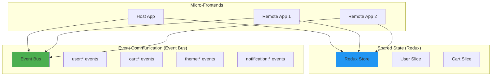

# Event Bus Implementation for Micro-Frontend Architecture

## Problem Statement

Currently, your micro-frontend architecture relies solely on **Redux** for state management and communication between micro-frontends. While Redux is excellent for shared state, it has limitations:

- **Tight Coupling**: All micro-frontends need to know about Redux slices
- **No Event Broadcasting**: Hard to broadcast one-time events (e.g., notifications, user logout)
- **State Overhead**: Not suitable for ephemeral events that don't need persistence
- **Cross-App Coordination**: Difficult to coordinate actions across independent apps

An **Event Bus** provides a decoupled, publish-subscribe communication pattern that complements Redux.

---

## Best Practices for Event Communication in Micro-Frontends

### 1. **Use Both Redux AND Event Bus** 🎯

> [!IMPORTANT]
> Don't replace Redux with an event bus. Use them together for different purposes.

| Pattern    | Use Case                                        | Example                        |
| ---------- | ----------------------------------------------- | ------------------------------ |
| **Redux**  | Shared state that needs persistence             | User profile, cart items       |
| **Events** | One-time notifications, actions, coordination   | Logout, theme change, toast    |
| **Events** | Cross-app coordination without shared state     | Navigation events, analytics   |
| **Events** | Ephemeral data that doesn't need Redux overhead | Form validation, notifications |

### 2. **Type Safety First** 🔒

Always use TypeScript to define event types and payloads.

```typescript
// ❌ BAD: Untyped events
eventBus.emit("user-logout");

// ✅ GOOD: Type-safe events
eventBus.emit<UserLogoutEvent>("user:logout", {
  userId: "123",
  timestamp: Date.now(),
});
```

### 3. **Namespaced Event Names** 📛

Use consistent naming conventions to avoid collisions.

```typescript
// Format: <domain>:<action>
"user:login";
"user:logout";
"cart:item-added";
"cart:item-removed";
"theme:changed";
"notification:show";
```

### 4. **Avoid Memory Leaks** 💧

Always unsubscribe from events when components unmount.

```typescript
useEffect(() => {
  const unsubscribe = eventBus.on("user:logout", handleLogout);
  return () => unsubscribe(); // Cleanup
}, []);
```

### 5. **Lightweight Library or Custom Implementation** ⚖️

**Options:**

- **Custom Event Bus** (100 lines): Full control, no dependencies
- **mitt** (200 bytes): Tiny, type-safe, fast
- **EventEmitter3** (2KB): More features, battle-tested

> [!TIP]
> For micro-frontends, **mitt** is the sweet spot: lightweight, type-safe, and well-maintained.

### 6. **Event Bus Lifecycle** 🔄

Initialize the event bus in a shared location accessible to all micro-frontends.

```
┌─────────────────┐
│   Shared Utils  │ ← Create & export event bus
└────────┬────────┘
         │
    ┌────┴────┬────────┬─────────┐
    │         │        │         │
┌───▼──┐  ┌──▼───┐ ┌──▼────┐ ┌──▼────┐
│ Host │  │ Rem1 │ │ Rem2  │ │ Other │
└──────┘  └──────┘ └───────┘ └───────┘
```

### 7. **Debugging & Logging** 🐛

Add logging middleware to trace event flow in development.

```typescript
if (import.meta.env.DEV) {
  eventBus.on("*", (type, payload) => {
    console.log(`[EventBus] ${type}`, payload);
  });
}
```

---

## Implementation Approach

### Architecture Decision: **Hybrid Pattern**

We'll implement a **hybrid communication pattern**:



### Why mitt?

After evaluating options, **mitt** is recommended because:

✅ **Tiny**: Only 200 bytes gzipped  
✅ **Type-safe**: Full TypeScript support  
✅ **Fast**: Uses Map for O(1) lookups  
✅ **Simple API**: `on()`, `off()`, `emit()`  
✅ **Wildcard support**: Listen to all events with `*`  
✅ **Well-maintained**: Active development, 10k+ stars

---

## User Review Required

### Breaking Changes: None ✅

This implementation is **additive** and won't break existing Redux-based communication.

### Design Decisions to Confirm

> [!CAUTION] > **Library Choice**: We're proposing **mitt** as the event bus library. If you prefer a custom implementation (no dependencies) or a different library, please let me know.

> [!IMPORTANT] > **Event Naming Convention**: We'll use the format `<domain>:<action>` (e.g., `user:logout`). Confirm if this aligns with your preferences.

---

## Proposed Changes

### Shared Utils Package

#### [NEW] [eventBus.ts](file:///d:/Projects/mirco-frontend/shared-utils/src/eventBus.ts)

Create a centralized, type-safe event bus:

- Install mitt library
- Define event types interface
- Export singleton event bus instance
- Add development logging middleware
- Export React hook for easy subscription

#### [NEW] [eventTypes.ts](file:///d:/Projects/mirco-frontend/shared-utils/src/eventTypes.ts)

Define all event types and payloads:

- Type-safe event definitions
- Organized by domain (user, cart, theme, etc.)
- Documentation for each event

#### [MODIFY] [package.json](file:///d:/Projects/mirco-frontend/shared-utils/package.json)

Add mitt dependency:

```json
"dependencies": {
  "mitt": "^3.0.1"
}
```

---

### Host App

#### [NEW] [hooks/useEventBus.ts](file:///d:/Projects/mirco-frontend/host-app/src/hooks/useEventBus.ts)

Custom React hook for event subscriptions:

- Automatically handles subscription/unsubscription
- Type-safe event listening
- Cleanup on unmount

#### [MODIFY] [App.tsx](file:///d:/Projects/mirco-frontend/host-app/src/App.tsx)

Demonstrate event bus usage:

- Add example event listeners (user logout, theme change)
- Add example event emitters (trigger logout event)
- Show integration with existing Redux patterns

---

### Remote App 1

#### [NEW] [components/Button.tsx](file:///d:/Projects/mirco-frontend/remote-app-1/src/components/Button.tsx)

Update button component to emit events:

- Emit `button:clicked` event on click
- Listen to `theme:changed` event
- Maintain existing Redux integration

---

### Remote App 2

#### [NEW] [components/Cart.tsx](file:///d:/Projects/mirco-frontend/remote-app-2/src/components/Cart.tsx)

Update cart to use event bus:

- Emit `cart:item-added` and `cart:item-removed` events
- Listen to `user:logout` to clear cart
- Keep Redux for cart state persistence

---

### Documentation

#### [NEW] [EVENT_BUS_GUIDE.md](file:///d:/Projects/mirco-frontend/EVENT_BUS_GUIDE.md)

Comprehensive guide for developers:

- When to use event bus vs Redux
- How to define new events
- Best practices and patterns
- Common pitfalls to avoid
- Migration guide from Redux-only patterns

---

## Implementation Details

### Event Bus API

```typescript
import { eventBus } from "sharedUtils/eventBus";

// Emit an event
eventBus.emit("user:logout", { userId: "123" });

// Listen to an event
const unsubscribe = eventBus.on("user:logout", (payload) => {
  console.log("User logged out:", payload.userId);
});

// Cleanup
unsubscribe();

// Listen to all events (debugging)
eventBus.on("*", (type, payload) => {
  console.log(`Event: ${type}`, payload);
});
```

### React Hook Usage

```typescript
import { useEventBus } from "@/hooks/useEventBus";

function MyComponent() {
  // Automatically cleans up on unmount
  useEventBus("user:logout", (payload) => {
    console.log("Handling logout:", payload);
  });

  return <div>Component</div>;
}
```

### Example Event Types

```typescript
export type EventBusEvents = {
  // User events
  "user:login": { userId: string; email: string };
  "user:logout": { userId: string; timestamp: number };
  "user:profile-updated": { userId: string; changes: Record<string, unknown> };

  // Cart events
  "cart:item-added": { itemId: string; quantity: number };
  "cart:item-removed": { itemId: string };
  "cart:cleared": { timestamp: number };

  // Theme events
  "theme:changed": { theme: "light" | "dark" };

  // Notification events
  "notification:show": { message: string; type: "info" | "success" | "error" };
  "notification:dismiss": { notificationId: string };
};
```

---

## Verification Plan

### Automated Tests

> [!NOTE]
> Unit tests will be added for the event bus functionality.

**Commands to run:**

```bash
# Install dependencies
cd shared-utils
npm install

# Run tests (to be implemented)
npm test
```

**Test coverage:**

- Event emission and reception
- Unsubscribe functionality
- Type safety validation
- Memory leak prevention (cleanup)
- Wildcard listener functionality

### Manual Verification

**User flow to test:**

1. **Start all micro-frontends**

   ```bash
   # Terminal 1
   cd host-app && npm run dev

   # Terminal 2
   cd remote-app-1 && npm run dev

   # Terminal 3
   cd remote-app-2 && npm run dev

   # Terminal 4
   cd shared-utils && npm run dev
   ```

2. **Test event flow:**

   - Click button in Remote App 1 → Should emit `button:clicked`
   - Host App should receive event and log it
   - Trigger logout from Host App → All remotes should react
   - Add item to cart in Remote App 2 → Host App should show notification

3. **Verify in DevTools:**

   - Open console
   - Check for `[EventBus]` logs
   - Verify no memory leaks (subscriptions properly cleaned up)

4. **Hot Module Replacement (HMR):**
   - Edit components that use event bus
   - Verify HMR works without breaking subscriptions

---

## Benefits of This Approach

### 1. **Decoupling** 🔓

Micro-frontends can communicate without knowing about each other's implementation.

### 2. **Flexibility** 🎨

Easy to add new events without modifying existing code.

### 3. **Performance** ⚡

Events are synchronous and extremely fast (no network overhead).

### 4. **Developer Experience** 👨‍💻

Type-safe API with autocomplete in IDEs.

### 5. **Debugging** 🐛

Centralized logging makes it easy to trace event flow.

### 6. **Backward Compatible** ✅

Works alongside existing Redux implementation.

---

## Migration Strategy

### Phase 1: Setup (This Implementation)

- Add event bus to shared-utils
- Create examples in all apps
- Document usage patterns

### Phase 2: Gradual Adoption (Your Choice)

- Identify actions that should be events (not state)
- Migrate one-time notifications to events
- Keep Redux for persistent state

### Phase 3: Optimization (Future)

- Add analytics tracking via event bus
- Implement error reporting through events
- Create event replay for debugging

---

## Alternative Approaches Considered

### ❌ **Custom Events (Browser API)**

**Why not:**

- No built-in TypeScript support
- Less performant than dedicated libraries
- More boilerplate code

### ❌ **EventEmitter3**

**Why not:**

- Larger bundle size (2KB vs 200 bytes)
- Unnecessary features for our use case

### ❌ **Redux-only Communication**

**Why not:**

- Overhead for ephemeral events
- Tight coupling between micro-frontends
- State pollution with transient data

### ✅ **mitt (Chosen)**

**Why yes:**

- Perfect balance of features and size
- Type-safe out of the box
- Battle-tested in production

---

## Next Steps After Implementation

1. **Add Analytics Integration**
   - Track events for user behavior analysis
2. **Error Reporting**

   - Emit error events for centralized logging

3. **Navigation Events**

   - Coordinate routing across micro-frontends

4. **Performance Monitoring**
   - Track event timing for optimization

---

## Resources

- [mitt GitHub Repository](https://github.com/developit/mitt)
- [Event-Driven Architecture Pattern](https://martinfowler.com/articles/201701-event-driven.html)
- [Micro-Frontend Communication Patterns](https://micro-frontends.org/)
- [TypeScript Event Emitters](https://www.typescriptlang.org/docs/handbook/2/generics.html)

---

## Summary

This implementation provides:

✅ **Type-safe event bus** using mitt  
✅ **React hooks** for easy integration  
✅ **Development tools** for debugging  
✅ **Documentation** and best practices  
✅ **Examples** in all micro-frontends  
✅ **No breaking changes** to existing code

The event bus will **complement** your existing Redux setup, giving you the best of both worlds: shared state management AND decoupled event communication.
