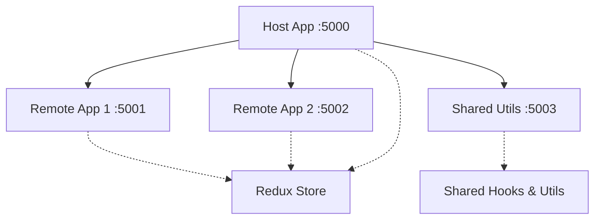

# Micro-Frontend Implementation Analysis & Learning Roadmap

## 📊 Current Architecture Overview

Your micro-frontend project follows a **Module Federation** pattern using Vite and consists of:

### Applications Structure

| Application      | Port | Exposed Modules  | Dependencies              |
| ---------------- | ---- | ---------------- | ------------------------- |
| **host-app**     | 5000 | Store, UserSlice | Consumes all remotes      |
| **remote-app-1** | 5001 | Button Component | Uses shared Redux         |
| **remote-app-2** | 5002 | Cart Component   | Uses shared Redux + hooks |
| **shared-utils** | 5003 | Hooks, Utils     | Provides utilities        |

---

## ✅ What You've Implemented

### 1. **Core Module Federation Setup**

- ✅ Vite + `@module-federation/vite` plugin configured
- ✅ Multiple remotes connected to host
- ✅ Dynamic imports with lazy loading and Suspense
- ✅ Proper shared dependencies (React, Redux, etc.)

### 2. **State Management**

- ✅ Centralized Redux store in host-app
- ✅ Dynamic reducer injection mechanism via `combineSlices`
- ✅ Shared state across micro-frontends
- ✅ Custom hook (`useInjectReducers`) for runtime reducer injection

### 3. **Component Sharing**

- ✅ Remote components (Button, Cart)
- ✅ Shared utilities and hooks
- ✅ Cross-application state synchronization

### 4. **Development Infrastructure**

- ✅ TypeScript configuration
- ✅ ESLint setup
- ✅ Individual dev servers for each application

---

## 💪 Strengths of Current Implementation

1. **Modern Tech Stack**: Using latest Vite + Module Federation
2. **Type Safety**: TypeScript across all applications
3. **Smart State Sharing**: Dynamic reducer injection pattern is advanced
4. **Separation of Concerns**: Clear boundaries between apps
5. **Lazy Loading**: Proper code splitting with React.lazy()

---

## ⚠️ Current Limitations & Gaps

### 1. **No Error Boundaries**

Remote modules can crash the host app without proper fallback.

### 2. **Missing Production Build Strategy**

- No deployment configuration
- No CDN setup for remote entries
- Hardcoded localhost URLs

### 3. **Limited Communication Patterns**

- Only using Redux for state
- No event bus or custom events
- No cross-app navigation strategy

### 4. **Type Safety Across Boundaries**

- No shared type definitions for remote modules
- Manual type annotations in imports

### 5. **No Monitoring or Debugging**

- No logging for module federation failures
- No performance monitoring
- No versioning strategy

### 6. **Limited Testing**

- No unit tests for federated modules
- No integration tests across boundaries
- No E2E tests for the full system

---

## 🎯 Recommended Next Steps & Learning Path

### **Phase 1: Strengthen Foundation** (1-2 weeks)

#### 1.1 Add Error Boundaries

Learn how to make your micro-frontend resilient.

> [!IMPORTANT]
> Without error boundaries, one remote failure can crash your entire application.

**What to implement:**

- Error boundary wrapper for each remote module
- Fallback UI for failed remotes
- Error reporting mechanism

**Learning concepts:**

- React Error Boundaries
- Graceful degradation
- Defensive programming

#### 1.2 Implement Proper Type Sharing

Create a shared types package.

**What to implement:**

- New `shared-types` package
- Type definitions for all exposed modules
- Proper TypeScript module declarations

**Learning concepts:**

- TypeScript module declarations
- Type-safe APIs
- Monorepo type sharing

#### 1.3 Add Comprehensive Logging

Track module federation lifecycle.

**What to implement:**

- Custom logger utility
- Module load success/failure tracking
- Performance metrics (module load time)

**Learning concepts:**

- Module Federation lifecycle hooks
- Browser Performance API
- Debugging distributed systems

---

### **Phase 2: Advanced Patterns** (2-3 weeks)

#### 2.1 Implement an Event Bus

Enable decoupled communication between micro-frontends.

**What to implement:**

- Custom event bus (or use library like `mitt`)
- Pub/Sub pattern for cross-app events
- Type-safe event definitions

**Learning concepts:**

- Event-driven architecture
- Pub/Sub pattern
- Decoupled communication

**Example use cases:**

- User logout notification across all apps
- Shopping cart updates
- Theme changes

#### 2.2 Add Routing & Navigation

Implement cross-application routing.

**What to implement:**

- React Router in host
- Route-based module loading
- Deep linking support
- Navigation state sharing

**Learning concepts:**

- Micro-frontend routing strategies
- URL synchronization
- Browser history management

#### 2.3 Create a Shared Component Library

Build a design system.

**What to implement:**

- New `ui-components` package
- Reusable UI components (buttons, forms, etc.)
- Theming support
- Storybook for documentation

**Learning concepts:**

- Design systems
- Component API design
- CSS-in-JS or CSS modules

---

### **Phase 3: Production Readiness** (2-3 weeks)

#### 3.1 Build & Deployment Pipeline

Prepare for production deployment.

**What to implement:**

- Production build scripts
- Environment-based configuration
- CDN deployment strategy
- CI/CD pipeline (GitHub Actions)

**Learning concepts:**

- Build optimization
- Asset hosting strategies
- Environment variables in MFE
- Continuous deployment

#### 3.2 Versioning & Compatibility

Handle breaking changes gracefully.

**What to implement:**

- Semantic versioning for remotes
- Version compatibility matrix
- Graceful fallback for version mismatches

**Learning concepts:**

- Semantic versioning
- Backward compatibility
- Contract testing

#### 3.3 Performance Optimization

Make your MFE fast.

**What to implement:**

- Bundle size analysis
- Code splitting optimization
- Preloading strategies
- Caching strategies

**Learning concepts:**

- Webpack/Vite bundle analysis
- Dynamic import optimization
- HTTP/2 push
- Service Workers

---

### **Phase 4: Advanced Features** (3-4 weeks)

#### 4.1 Micro-Frontend Orchestration

Implement a shell application pattern.

**What to implement:**

- App registry/catalog
- Dynamic module discovery
- Feature flags
- A/B testing framework

**Learning concepts:**

- Runtime configuration
- Feature toggles
- Progressive rollouts

#### 4.2 Server-Side Rendering (SSR)

Add SSR support for better SEO and performance.

**What to implement:**

- Next.js integration or Vite SSR
- Module Federation with SSR
- Hydration strategy

**Learning concepts:**

- SSR in micro-frontends
- Hydration issues
- Edge computing

#### 4.3 Observability & Monitoring

Production monitoring and debugging.

**What to implement:**

- Error tracking (Sentry)
- Performance monitoring (Web Vitals)
- User analytics
- Distributed tracing

**Learning concepts:**

- Application Performance Monitoring (APM)
- Real User Monitoring (RUM)
- Distributed systems observability

---

## 📚 Learning Resources by Phase

### Phase 1 Resources

- [Error Boundaries in React](https://react.dev/reference/react/Component#catching-rendering-errors-with-an-error-boundary)
- [TypeScript Module Federation Types](https://github.com/module-federation/module-federation-examples/tree/master/typescript)
- [Web Performance APIs](https://developer.mozilla.org/en-US/docs/Web/API/Performance)

### Phase 2 Resources

- [React Router - Micro Frontends](https://reactrouter.com/)
- [Event-Driven Architecture Patterns](https://martinfowler.com/articles/201701-event-driven.html)
- [Storybook for Design Systems](https://storybook.js.org/)

### Phase 3 Resources

- [Module Federation Production Guide](https://module-federation.io/guide/basic/production.html)
- [GitHub Actions for JS](https://docs.github.com/en/actions)
- [Vite Build Optimization](https://vitejs.dev/guide/build.html)

### Phase 4 Resources

- [SSR with Module Federation](https://github.com/module-federation/module-federation-examples/tree/master/nextjs-ssr)
- [Feature Flags Best Practices](https://martinfowler.com/articles/feature-toggles.html)
- [Web Vitals](https://web.dev/vitals/)

---

## 🚀 Immediate Next Actions (This Week)

Based on your current implementation, I recommend starting with these specific tasks:

### 1️⃣ Add Error Boundaries (2-3 hours)

Create a `RemoteModuleErrorBoundary` component to wrap each lazy-loaded remote.

### 2️⃣ Create Shared Types Package (3-4 hours)

- Create `shared-types` folder
- Define interfaces for exposed modules
- Add proper TypeScript references

### 3️⃣ Environment Configuration (2 hours)

Replace hardcoded URLs with environment variables for different environments.

### 4️⃣ Add Basic Logging (2 hours)

Create a simple logger to track module loading success/failures.

---

## 🎓 Key Concepts to Master

| Priority  | Concept            | Why Important               |
| --------- | ------------------ | --------------------------- |
| 🔴 High   | Error Handling     | Prevents cascading failures |
| 🔴 High   | Type Safety        | Reduces runtime errors      |
| 🟡 Medium | Event-Driven Comm. | Decouples applications      |
| 🟡 Medium | Routing Strategies | Better UX and navigation    |
| 🟢 Low    | SSR/SSG            | SEO and performance boost   |
| 🟢 Low    | Observability      | Production debugging        |

---

## 💡 Bonus: Alternative Architectures to Explore

Once comfortable with Module Federation, explore:

1. **Single-SPA** - Framework-agnostic micro-frontends
2. **Web Components** - Standards-based approach
3. **iFrame-based** - Traditional but isolated approach
4. **Build-time composition** - Tools like Nx or Lerna

---

## ✨ Final Recommendations

> [!TIP]
> Start with **Phase 1** - the foundation improvements will make everything else easier. Don't skip error boundaries!

Your current implementation shows good understanding of:
✅ Module Federation basics
✅ State management in distributed systems
✅ Code splitting and lazy loading

**Next learning focus should be:**

1. **Resilience** (error handling, fallbacks)
2. **Type safety** across boundaries
3. **Production deployment** strategies

Would you like me to help implement any of these specific improvements?
